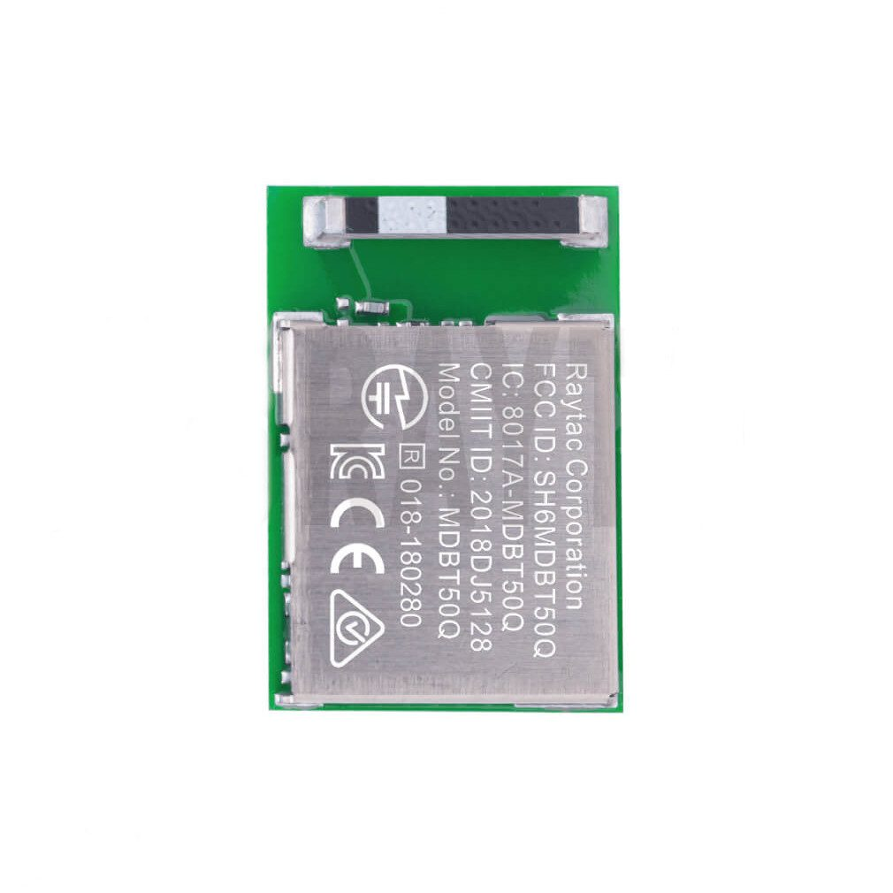
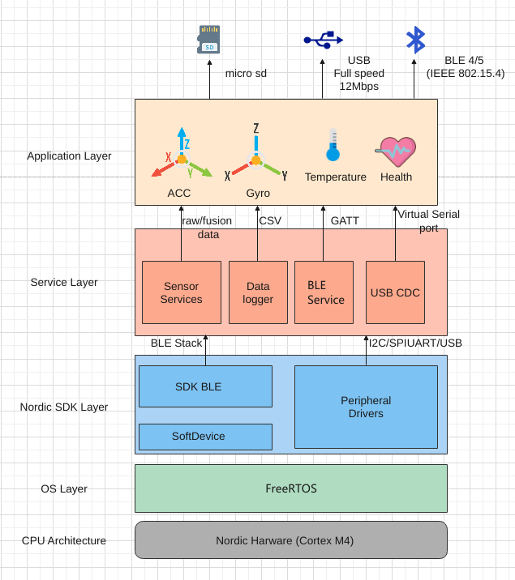
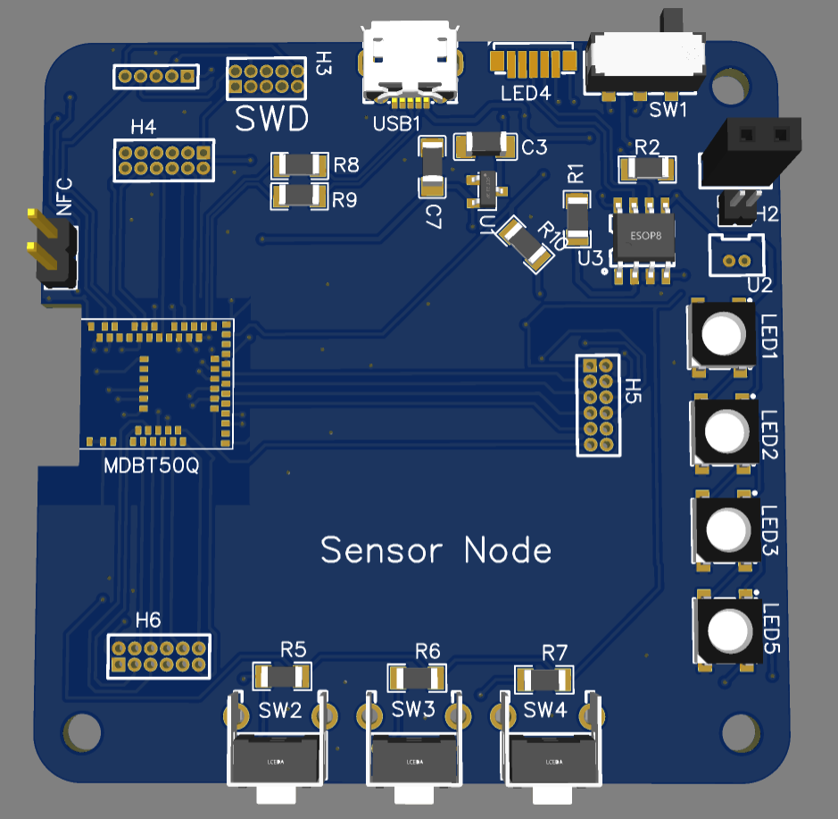

# NRFNode簡介

[TOC]

## 支援硬體

 * NRFNode - (PCA-10100/S140) 
 * Thingy52 (僅支援部分的Service)

## 支援應用平台

|        | win10 | linux | iOS  | ANDROID |
| ------ | :---: | :---: | :--: | :-----: |
| V1.0.0 |   ✔️   |   ✔️   |  ✔️   |    ❓    |
|        |       |       |      |         |

## 目錄結構

- Hardware - 包含PCB電路GERBER圖檔、外殼圖檔及加工說明。
- Software -  包含應用程序，APP以及桌面開發程式。
- Firmware - 包含 nrf52的驅動程式以及測試程式
- Tools  - 生產工具

## BLE模組

MDBT50Q  nRF52833

## 韌體架構圖

韌體主要由5~6層，大致可以分為以下幾層:

- Application Layer - 開發者可以自行開發應用功能，例如防跌倒偵測。
- Service Layrer - 事先提供的特定服務層，開發者可以透過這層的API快速寫出產品原型
- Nordic SDK Layer - 廠商所提供的HAL，用以開發service Layer以及application Layer
- OS Layer - 即時嵌入式系統FreeRTOS
- CPU Achitecture- nrf52833 為 Cortex M4 內核，可以通用M4支援的CMSIS API。

硬體外觀

輸出入介面:

目前輸出介面提供幾種通訓方式

1. BLE 4.2/5.1
2. USB CDC
3. UART
4. SPI
5. I2C
6. NFC
7. 3 Buttons
8. WS2812B (LED)

## 電源:

可外接3.7v Li-Po電源或5vUSB電源供電

## 版本更新:

V1

V2
